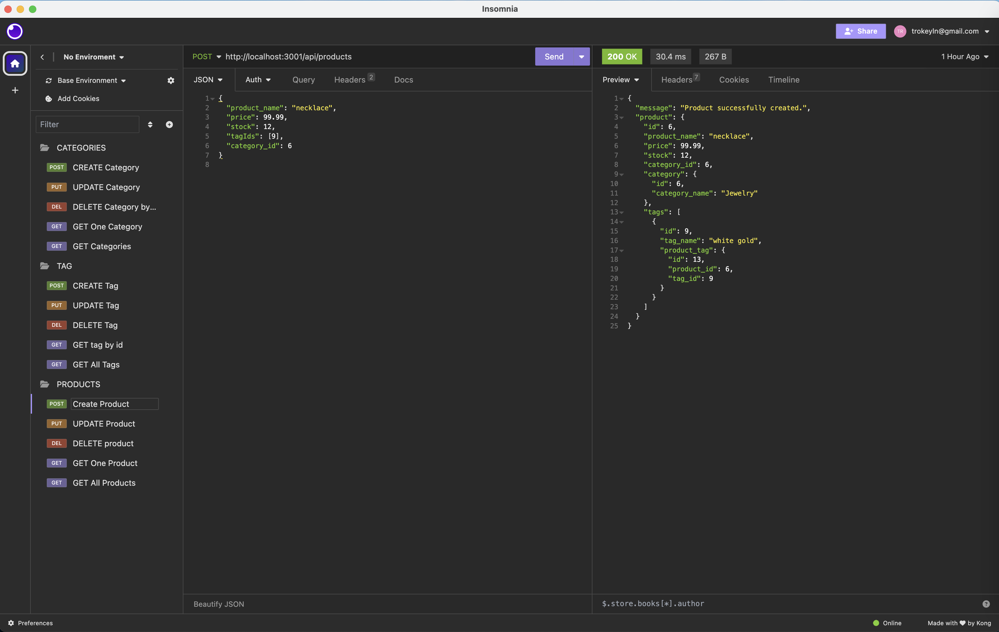
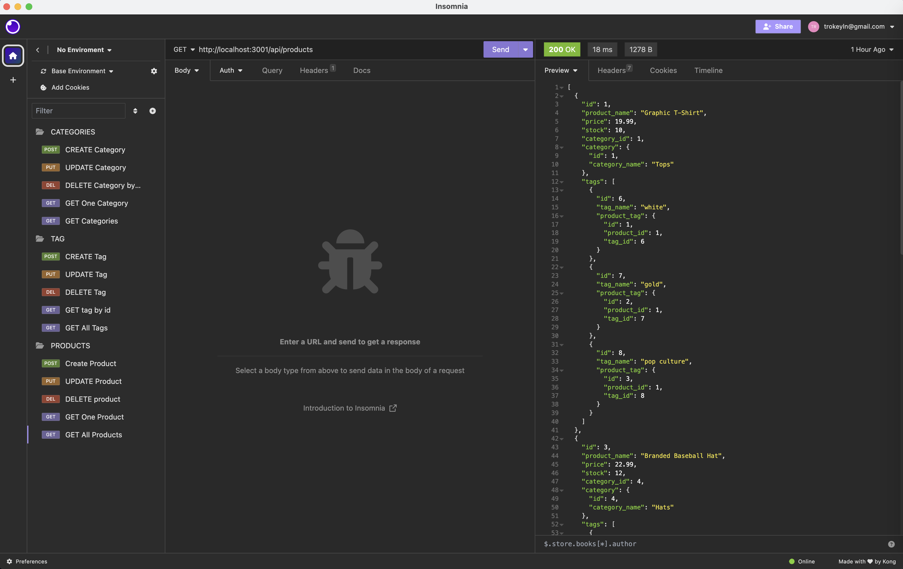
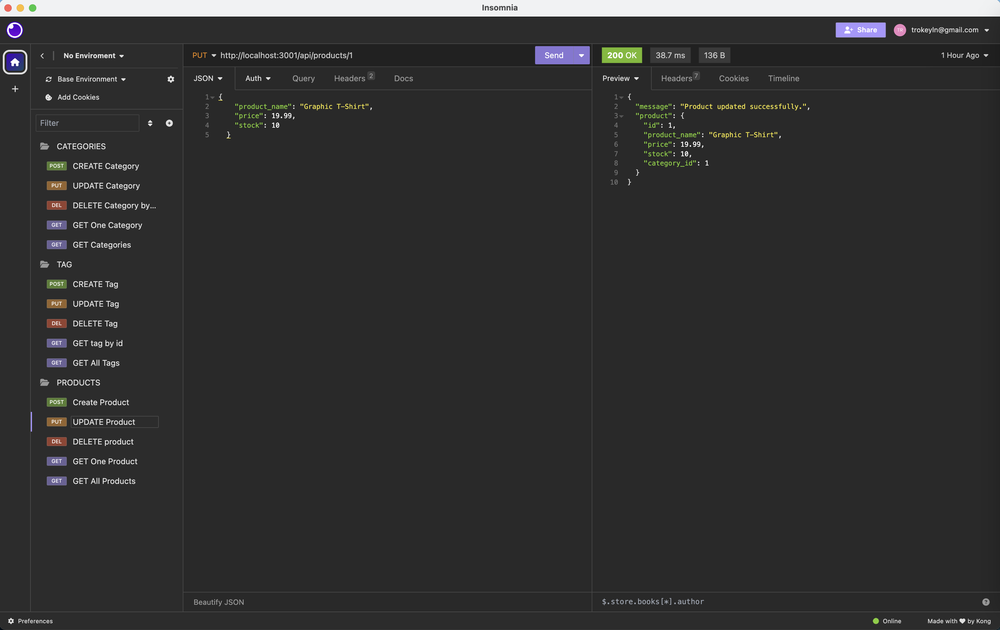
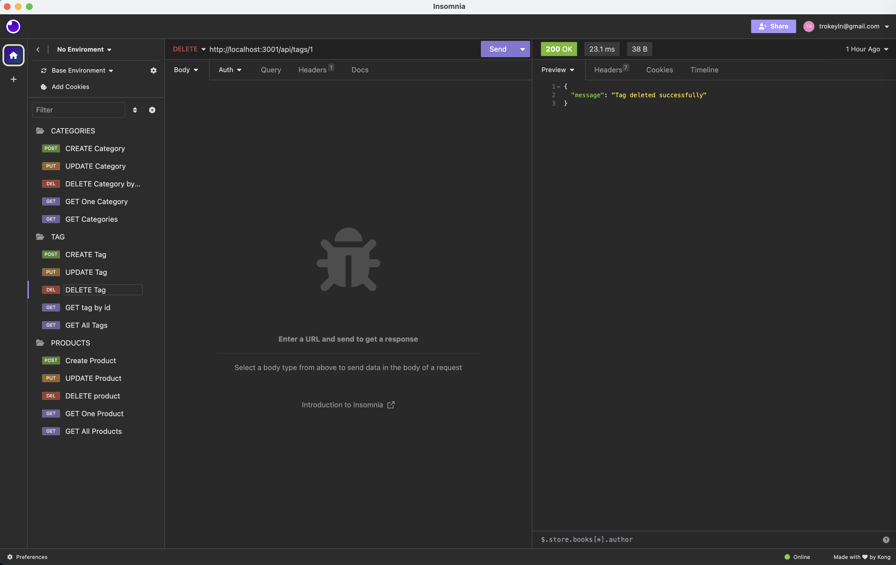

# ORM E-Commerce Backend

[](https://opensource.org/licenses/MIT)

[Link to video presentation](https://drive.google.com/file/d/1ORioXpBNkgLfxZnT2S-0JrYgwSY513V0/view)

## Description

Welcome to my E-Commerce Backend application, an innovative system meticulously crafted to empower internet retail companies. Harnessing the power of the latest technologies, this application is built with Node.js for scalability, Express.js for a robust backend, and Sequelize as the ORM for seamless database interactions. By leveraging the strength of these technologies, the application ensures speed, flexibility, and efficiency, making it a cutting-edge solution for the dynamic landscape of internet retail.

## Table of Contents
- [Installation](#installation)
- [Usage](#usage)
- [Badges](#badges)
- [Features](#features)
- [Questions](#questions)

## Installation
1. **Clone the Repository**
    ```
    git clone https://github.com/your/repository.git
    cd employee-management-system
    ```
2. **Install Dependencies**
    ```
    npm i
    ```
    **Dependencies**

    - This application utilizes Node.js along with the following key dependencies:
    ```
    mysql: ^2.18.1
    npm i dotenv
    npm i sequelize
    npm i express
    npm i nodemon
    ```
3. **Database Setup**
   - Schema Creation: Run the schema.sql file provided in the db directory to create the necessary tables for the application. You can execute this SQL script in your MySQL environment directly or use commands like:
   ```
    mysql -u your_username -p

    < source db/schema.sql
   ```
   - Seed Initial Data (exit MySQL):

   ```
    npm run seed
   ```
4. **Configuration**
    - Update the connection settings in the config/connection.js & .env file to match your MySQL database credentials.

## Usage

1. Run the Application

    - After following the installation instructions, execute the application by running the following command:

    ```
    npm start || nodemon server.js
    ```

2. Explore with Insomnia Core:

    - Open Insomnia Core to test and interact with the API routes.
    - Use the provided API routes for categories, products, or tags to retrieve and manipulate data.
    - Ensure proper data formatting by checking the well-structured JSON responses.
    - Test API POST, PUT, and DELETE routes to create, update, and delete data in the connected database.

    

    

    

    

## Badges


## Features:
**Express.js API:** A robust and functional Express.js API serves as the backbone of your e-commerce platform, providing a seamless and responsive experience for your users.

**Sequelize Database Integration:** Connect effortlessly to your MySQL database by setting up environment variables for your database name, MySQL username, and password. With Sequelize, database interactions are simplified, allowing for efficient data management.

**Database Initialization:** Easily create and seed your development database with test data using simple schema and seed commands. This ensures that your database is ready for development and testing.

**Automatic Model Sync:** Upon launching your application, the Sequelize models automatically synchronize with your MySQL database, streamlining the process of managing and updating your data model.

**API Routes for Categories, Products, and Tags:** Effortlessly retrieve data through API GET routes in tools like Insomnia Core. Categories, products, and tags are organized and displayed in a well-formatted JSON format, providing easy access to essential information.

**CRUD Operations:** Test and perform essential CRUD (Create, Read, Update, Delete) operations with ease. The API includes POST, PUT, and DELETE routes, allowing you to seamlessly manage and manipulate data in your database.

**Error Handling (200, 400, 500):** Comprehensive error handling ensures a smooth user experience. Proper handling of HTTP status codes 200 (OK), 400 (Bad Request), and 500 (Internal Server Error) guarantees that your application gracefully manages success, client-side errors, and server-side errors.

## Questions
[GitHub Profile](https://github.com/ltrokey)

Please feel free to contact me via the email link below.

[Email](mailto:trokeyln@gmail.com)